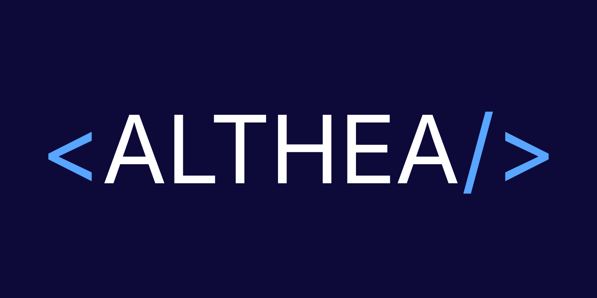

# &lt;ALTHEA/&gt; — C++ Shorthand Translator

<div align="center">
  
</div>

A fast, client-side web tool that converts personal C++ macros and shorthand into standard, compilable C++. Built for competitive programmers who work with a custom header (`Nonbangkok.h`) and want to share or submit clean code instantly.

## Features

- **Split-pane editor** — input and output side-by-side on desktop, stacked on mobile
- **Auto-translate mode** — translate as you type with a single toggle
- **Zero latency** — all processing runs in-browser; no server, no API calls
- **Privacy-first** — your code never leaves your machine
- **No dependencies** — pure HTML, CSS, and JavaScript

## Quick Start

Open `index.html` directly in your browser, or serve it locally:

```bash
python3 -m http.server 8080
# then open http://localhost:8080
```

## Cheat Sheet

| Shorthand | Translated Output |
|---|---|
| `#include <Nonbangkok.h>` | `#include <bits/stdc++.h>` |
| `macos;` | `ios::sync_with_stdio(0);cin.tie(0);cout.tie(0);` |
| `forr(i, 0, n)` | `for(int i=0;i<n;i++)` |
| `forl(i, n, 0)` | `for(int i=n;i>0;i--)` |
| `coutf(6, ans)` | `cout << fixed << setprecision(6) << ans` |
| `endll` | `"\n"` |
| `sp` | `" "` |

Lines starting with `#define` are automatically stripped from the output.

## Why ALTHEA?

Competitive programming often involves personal headers and shorthand that speed up coding during contests but aren't valid in judge environments or shared codebases. ALTHEA bridges that gap — paste your code, hit Translate, and get clean standard C++ instantly, with no upload, no login, and no waiting.
